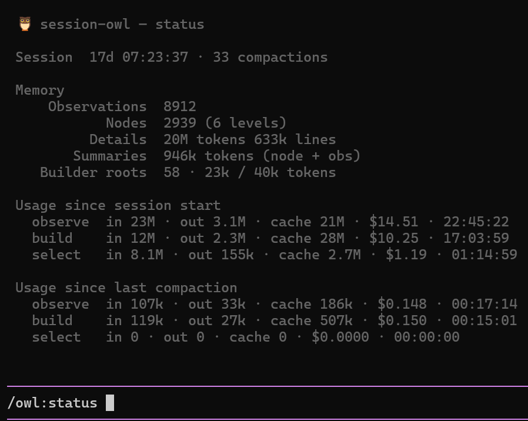

# avtc-pi-session-owl

A working-memory extension for [pi](https://pi.dev) — maintains a knowledge graph across context compactions and renders a task-relative summary into each compaction, so the agent picks up after each compaction with its goal, decisions, and important context intact.


## Features

- **Persistent memory** — observations (immutable, source-backed) are captured continuously and organized into a semantic node graph that lasts across every compaction.
- **Compaction summary** — at compaction, the graph's root level is refined toward a token budget and rendered into the summary pi injects; the full detail remains available to the agent via recall.
- **Task-relative** — a Selector picks the nodes that matter to the current work and the planned next tasks; superseded and stale context drops out.
- **Browse session memory** — `/owl:ls`, `/owl:cat`, `/owl:find` let you list, inspect, and search your memory graph; the `owl_recall` tool lets the agent recall on demand.
- **Live status widget** — a footer line shows the active maintenance stage, its progress, and its token cost.

## Installation

```bash
pi install npm:avtc-pi-session-owl
```

## How it works

session-owl runs three maintenance stages:

1. **Observer** — watches the session turn-by-turn and captures observations: condensed, source-backed facts. Each captured fact becomes a node in the graph.
2. **Builder** — maintains the graph: groups, merges, supersedes, and re-rates nodes so the structure stays coherent and bounded.
3. **Selector** — curates a task-relative view (the active set) from the maintained graph.

At compaction, the active set is rendered into the compaction summary that pi injects afterward — the agent's post-compaction memory:

```
# Memory
Your session memory — the top level of a tree; each id opens deeper detail via owl_recall.
Legend: 📁 n.. node · 📄 o.. observation (obs) · importance crit high med low (how much it matters if lost) · 📦archived 🪦obsolete · 2nodes 3obs (direct children) · 34lines 412tokens (direct children observations full details size)

## Memory use
The root view is a navigation index into retained session memory: the lines name what exists; the detail, evidence, rationale, and results live in the tree behind them, across the whole session (see the totals). Recall before relying on session-derived understanding: search memory, or expand a visible related id — a complete-looking label still summarizes only the surface, and relevant context often sits deeper than the root. Use {"ids":["n23"]} to expand, {"query":"…"} to search, and add "fullDetails":true when exact messages, tool output, or rationale matter.

## Initial prompt
Redesign the auth flow: move JWT validation to middleware and drop the legacy login form.

## Active set
📁 nGoal · crit · Redesign auth flow (JWT middleware, drop legacy login) · 3nodes 1obs · 2lines 45tokens · Jul 28 14:30 — Jul 29 09:15
📁 n12 · high · Auth flow redesign · 1obs · 2lines 15tokens · Jul 28 14:30 — Jul 29 09:15
📁 n8 · high · Decisions · 5obs · 214lines 5100tokens · Jul 28 14:30 — Jul 29 09:15
📁 n6 · 📦low · Old login form · 2obs · 96lines 2300tokens · Jul 27 09:00 — Jul 27 18:00
📁 nIrrelevant · med · Irrelevant · 4obs · 12lines 260tokens · Jul 28 14:30 — Jul 29 09:15
---
Source tree total: 237 nodes (4 levels) · 273 observations · 10k lines 576k tokens of details · 3 compactions

## Recently touched
Jul 29 09:10 read src/auth/middleware.ts:1-40,120-180
Jul 29 09:12 edit src/auth/jwt.ts
Jul 29 09:15 write src/auth/index.ts
```

After compaction the agent continues with this summary alongside pi's own recent-context tail.

## The memory graph

The graph is a containment tree of **nodes** (folders) holding **observations** (leaves). It renders the same way everywhere — the agent's `owl_recall`, the Builder and Selector tools, and the `/owl:ls`/`/owl:cat`/`/owl:find` commands:

```
📁 nGoal · crit · The session goal · 4nodes 1obs · 2lines 45tokens · Jul 28 14:30
  📁 n12 · high · Auth flow redesign · 1obs · 2lines 15tokens · Jul 28 14:30 — Jul 29 09:15
    📄 o31 · med · JWT validation moved to middleware · 2lines 15tokens · Jul 28 14:30
  📁 n8 · high · Decisions · 5obs · 214lines 5100tokens · Jul 28 14:30 — Jul 29 09:15
  📁 n6 · 📦low · Old login form · 2obs · 96lines 2300tokens · Jul 27 09:00 — Jul 27 18:00
  📁 n3 · 🪦med · YAML config · → n8 · 1obs · 1line 12tokens · Jul 27 09:00
📁 n5 · med · Scratch · 2obs · 38lines 900tokens · Jul 28 14:30 — Jul 29 09:15
```

(*📁* *n..* node · *📄* *o..* observation (obs); importance *crit*/*high*/*med*/*low* (how much it matters if lost); state glyphs *📦* archived · *🪦* obsolete · *🆕* new, Builder view only; 2nodes 3obs (direct children) · 34lines 412tokens (direct children observations full details size).)

**How the agent operates it.** The Builder and Selector navigate and edit the graph with filesystem-style tools — `ls`, `cat`, `find` to read; `mkdir`, `mv`, `merge`, `supersede` (Builder-only), `set_meta` to reorganize; `try_finish` to converge the root view on its budget. The Builder maintains the source graph; the Selector builds a curated copy (the active set) for the summary. The agent itself uses the read-only `owl_recall` to fetch and search on demand.

## Status widget

While session-owl works, a footer line shows the active stage, its progress, and its token cost:

```
🦉 1005(+11) obs 150/371 → 95 roots 35k/40k · 8.0k/262k · 3.4k tok · +3 obs
```

(observation/node counts with deltas since the stage started · chunk batch N/M during an observe run · root-view tokens vs budget · context-window usage · streamed output tokens · observations accepted in the current chunk but not yet persisted — appears only while a chunk is actively recording).

## Tools

| Tool | Description |
|---|---|
| `owl_recall` | Recall from memory — fetch by id, filter by time range, or regex search. Targets the rendered tree (selected-root or observations-root). |

## Commands

| Command | Description |
|---|---|
| `/owl:status` | Show memory stats and per-phase token/cost usage (since last compaction and since session start) |
| `/owl:ls [nodeId]` | List root nodes, or a node's children |
| `/owl:cat <id>` | Show a node (with its observations) or a single observation in full |
| `/owl:find <query>` | Search memory (regex; current items) |
| `/owl:find-all <query>` | Search memory (regex; everything, including superseded) |
| `/owl:rescan` | Discard the current memory graph and re-observe the entire session from the start (asks confirmation). With `--reuse-observations`: rebuild the graph structure from the collected observations without re-observing |
| `/owl:reobserve-0-obs-chunks` | Re-observe session ranges that were skipped with zero observations (repair after a degraded model run) |
| `/owl:settings` | Open the settings UI |

`/owl:status` output:



## Configuration

Four independent mode axes, all live-toggleable mid-session:

| Setting | Options | Default |
|---|---|---|
| `observerMode` | `on-threshold` · `on-compaction` | `on-threshold` |
| `builderMode` | `on-compaction` · `each-N-observations` · `on-session-context-threshold` · `on-root-view-threshold` | `each-N-observations` |
| `selectorMode` | `on-compaction` · `on-session-context-threshold` | `on-compaction` |
| `renderMode` | `selected-root` (Selector curates) · `observations-root` (the Builder's root view) | `observations-root` |

The defaults keep the observations graph in shape, so when a compaction is triggered the summary is immediately provided — tune the modes and thresholds to your model and workload. Two shape knobs — `rootViewTargetNodes` (how many roots to aim for; no target = the agent shapes the root view on its own) and `rootViewStrategy` (task · category · recency · importance · topic) — advise the Builder and Selector on the root view's organization. See [CONFIGURATION.md](docs/CONFIGURATION.md) for the full schema reference (every knob, defaults, per-component model presets).

## Conflicts with other extensions

Pi's compaction hook is last-registration-wins: when two extensions customize compaction, only the last one registered has an effect — the other silently does nothing. Pi has no mechanism for extensions to veto each other.

Session Owl handles this by checking, at every start, whether another compaction-handling extension is installed (from `~/.pi/agent/settings.json`, `<project>/.pi/settings.json`, and the pi extension dirs). When it finds one, it stays dormant — it collects no observations, compaction falls through to pi's native summary or the other extension's, and the widget shows a paused line:

```text
🦉 ⚠ paused — pi-blackhole also handles compaction (/owl:status)
```

The pause is runtime-only (nothing is written to your settings): remove the other extension and restart pi, or toggle `ignoreConflicts` in /owl:settings — session-owl resumes immediately, even mid-session.

Unknown or future packages are caught by a source scan for the override-shaped compaction-hook registration in installed package dirs (best effort — passive listeners that only observe compaction events never trigger it). Known compaction-handling packages are also checked by name — a curated list maintained in session-owl's source — so forks and renamed copies are caught even when their code shape changes.

### Forcing session-owl on

If you deliberately run session-owl alongside another compaction handler (e.g. for benchmarking), set `ignoreConflicts: true` in the session-owl settings (/owl:settings). The last-registered extension wins — with this enabled you are choosing that fight knowingly.

## Full suite

Check out the full suite of related extensions, [avtc-pi](https://github.com/avtc/avtc-pi) — deterministic feature development, subagent delegation, working-memory, behavioral learning, parallel-work guardrails, durable decisions, notifications, and more.

Developed with [Z.ai](https://z.ai/subscribe?ic=N5IV4LLOOV) — get 10% off your subscription via this referral link.

## License

MIT
